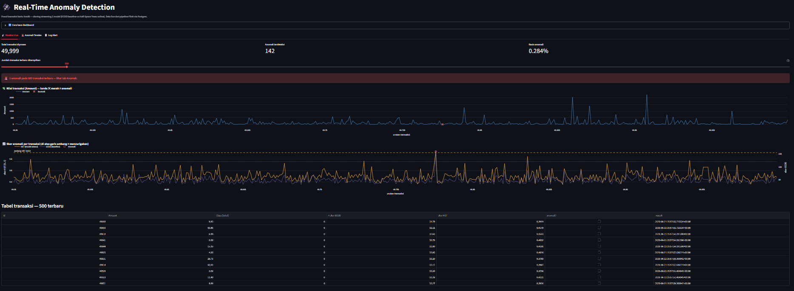
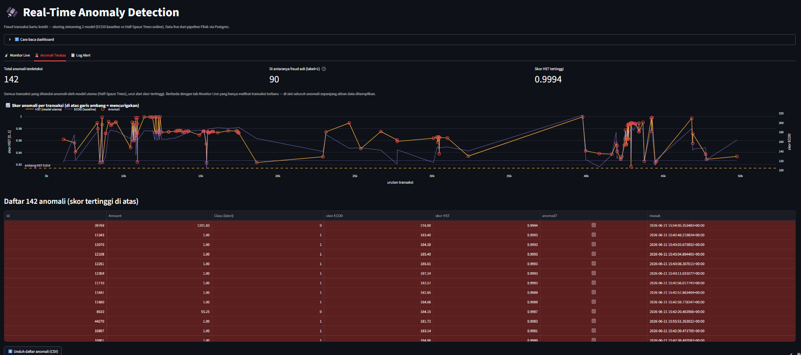
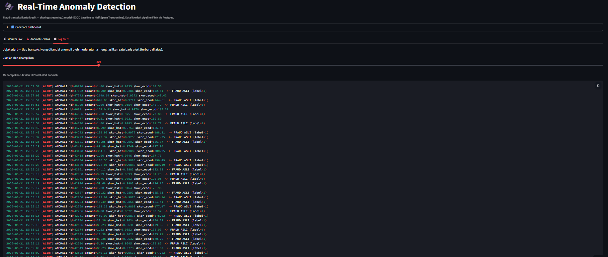

# 🛰️ Real-Time Anomaly Detection Pipeline

Deteksi **fraud transaksi kartu kredit** secara *real-time* dengan arsitektur streaming
penuh, membandingkan dua model anomaly detection: **ECOD** (baseline statistik
parameter-free) vs **Half-Space Trees** (online learning sejati, belajar per-transaksi).

### 🔴 [**Demo online → realtimeanomalydetection-aryasatyaa45.streamlit.app**](https://realtimeanomalydetection-aryasatyaa45.streamlit.app/)

Dashboard membaca hasil run pipeline (50.000 transaksi) dari Supabase (Postgres terkelola).

---

## Tampilan Dashboard

**📡 Monitor Live** — pantau transaksi terbaru, skor 2 model, dan garis ambang.


**🚨 Anomali Teratas** — 142 anomali diurutkan skor HST, tandai fraud asli (label=1).


**📋 Log Alert** — daftar alert tiap anomali terdeteksi.


---

## Arsitektur

```
data/creditcard.csv
        │  replay
        ▼
   ┌─────────┐   HTTP    ┌──────┐  bridge  ┌───────┐  POST /score  ┌────────┐
   │producer │ ───────▶  │ Iggy │ ───────▶ │ Flink │ ────────────▶ │ scorer │
   └─────────┘  (antri)  └──────┘  socket  └───┬───┘   (per event) └────────┘
                                               │ sink (2x)        ECOD + HST
                          ┌────────────────────┴───────────────┐
                          ▼                                     ▼
                   ┌────────────┐                        ┌────────────┐
                   │  Paimon    │                        │  Postgres  │ ──▶ Supabase
                   │ (lakehouse)│                        └─────┬──────┘    (online)
                   └────────────┘                              ▼
                                                        ┌────────────┐
                                                        │ Streamlit  │  📡 Monitor Live
                                                        │ dashboard  │  🚨 Anomali Teratas
                                                        │            │  📋 Log Alert
                                                        └────────────┘
```

| Lapisan | Teknologi |
|---------|-----------|
| Sumber | Python producer (replay CSV, retry-backoff) |
| Broker | Apache Iggy (HTTP API) |
| Stream processing | Apache Flink / PyFlink (skor per-event + window) |
| Model | PyOD `ECOD` + River `HalfSpaceTrees` |
| Storage | Apache Paimon (lakehouse) **+** Postgres (dashboard) |
| Dashboard | Streamlit (deploy ke Streamlit Cloud) |
| Online DB | Supabase (Postgres terkelola) |
| Orkestrasi | Docker Compose |

---

## Hasil — ECOD vs Half-Space Trees

Dievaluasi pada *test set* (85.443 transaksi, 148 fraud). Karena data **sangat
imbalanced** (~0.17% fraud), metrik utama adalah **PR-AUC / F1**, **bukan** accuracy
(model "selalu normal" pun beraccuracy 99.83% tapi recall 0%).

| Model | PR-AUC | F1 | Precision | Recall | ROC-AUC | Ambang |
|-------|:------:|:--:|:---------:|:------:|:-------:|:------:|
| **Half-Space Trees** 🏆 | **0.387** | **0.474** | 0.516 | 0.439 | 0.950 | 0.914 |
| ECOD (baseline) | 0.252 | 0.349 | — | — | 0.946 | 120.58 |
| _acak_ | 0.0017 | — | — | — | 0.5 | — |

**Half-Space Trees menang** dan dipakai sebagai keputusan akhir (`is_anomali`), karena
sifat *online*-nya cocok dengan tema streaming — model belajar tiap transaksi tiba.

> Validasi pipeline (fresh run 50.000 transaksi): **142 anomali** terdeteksi,
> skor HST maks **0.9994**, skor ECOD maks **216.00**.

---

## Dataset

Credit Card Fraud Detection (Kaggle `mlg-ulb/creditcardfraud`) — 284.807 transaksi,
fitur `Time`, `V1`–`V28` (hasil PCA), `Amount`, `Class`. Fraud ~0.17%.

---

## Cara Menjalankan (lokal)

```bash
# 1. Config
cp .env.example .env

# 2. Dataset → data/creditcard.csv (unduh dari Kaggle)

# 3. Unduh jar Flink/Paimon/JDBC (besar, di-gitignore)
bash scripts/fetch_jars.sh

# 4. Jalankan seluruh pipeline
docker compose up -d
```

Pipeline langsung mengalir tanpa langkah manual: producer seed 50.000 transaksi →
Flink skor per-event → tersimpan ke Paimon **dan** Postgres.

Dashboard: **http://127.0.0.1:8501** (pakai `127.0.0.1`, bukan `localhost` — di Windows
`localhost` resolve ke IPv6 dulu = lambat).

---

## Deploy online (Level 2)

Dashboard di-deploy ke **Streamlit Cloud** dan membaca snapshot hasil run dari **Supabase**:

1. Buat project Supabase → muat skema + data:
   ```bash
   psql "<SUPABASE_CONNECTION_STRING>" -f db/seed_supabase.sql
   ```
2. Deploy `dashboard/app.py` ke Streamlit Cloud (connect repo GitHub ini).
3. Set secret `DASHBOARD_DB_URL` = connection string Supabase.

`app.py` otomatis pakai `DASHBOARD_DB_URL` bila diset (online), atau `POSTGRES_*` (lokal).

---

## Struktur

```
producer/    replay CSV → Iggy (HTTP) + bridge Iggy→socket utk Flink
ml/          train.py, evaluate.py, scorer.py (service HTTP skor 2 model)
flink_job/   job.py (PyFlink: skor per-event + sink Paimon & Postgres)
dashboard/   app.py (Streamlit: Monitor Live + Anomali Teratas + Log Alert)
db/          init.sql (skema) + seed_supabase.sql (skema+data utk online)
scripts/     fetch_jars.sh
docs/        catatan per-minggu
```

## Lisensi

MIT
